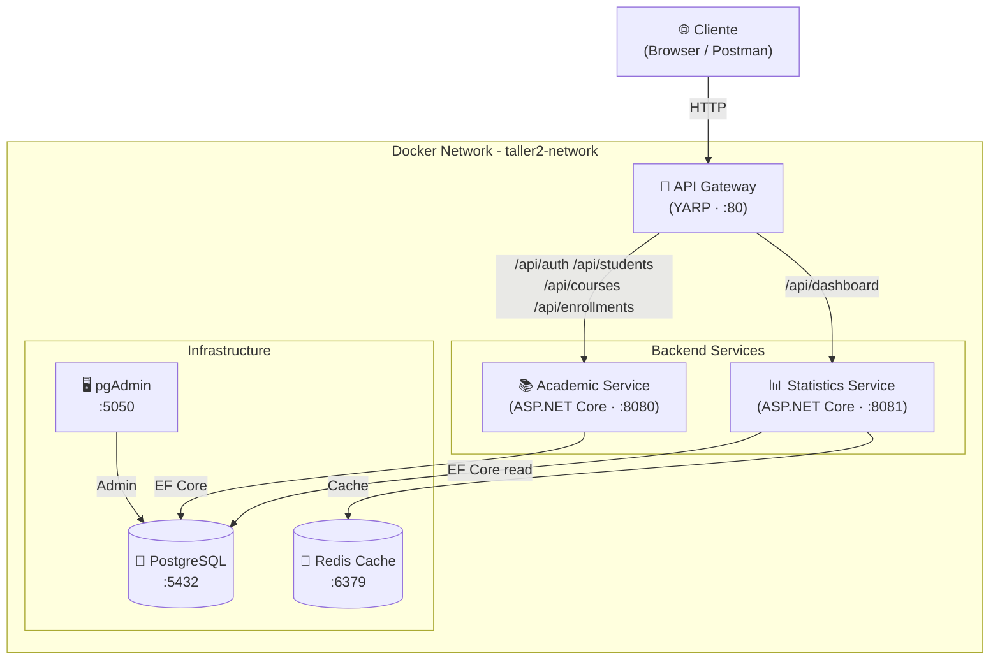
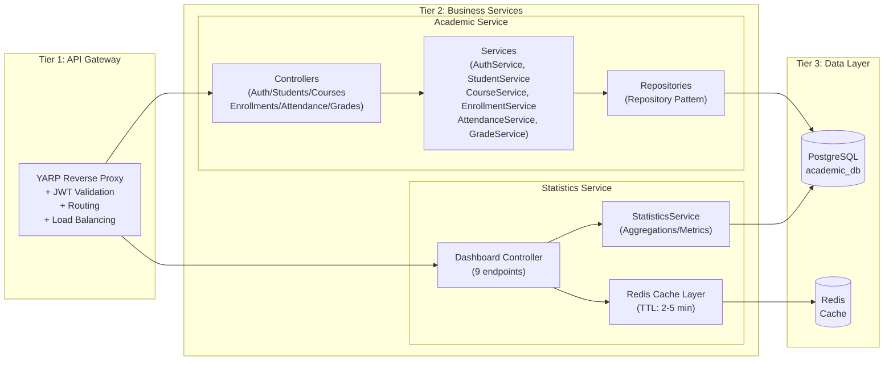
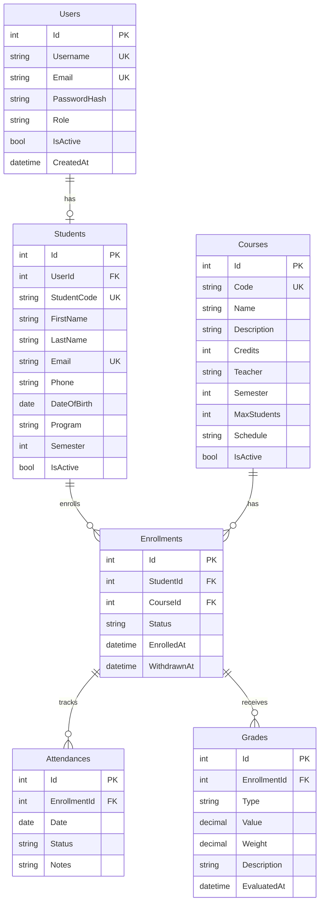

# Taller2NET — Arquitectura Backend N-Tier con .NET 8

> **Taller Universitario** | Arquitectura Backend · Service-Based (N-Tier) · Docker · .NET 8 · PostgreSQL · Redis

---

## 📐 Arquitectura Elegida: Service-Based Architecture (N-Tier)

### Comparación de Aproximaciones

| Criterio | Monolítica | **Service-Based ✅** | Microservicios |
|---|---|---|---|
| Complejidad de implementación | Baja | **Media** | Alta |
| Escalabilidad | Baja | **Alta por servicio** | Máxima |
| Mantenimiento | Sencillo | **Modular** | Complejo |
| Despliegue | Simple | **Dockerizado** | Kubernetes needed |
| Adecuado para académico | Sí | **Sí (ideal)** | Excesivo |
| Comunicación | Interna | **HTTP/REST** | gRPC/Eventos |
| Base de datos | Una compartida | **Compartida (separable)** | Una por servicio |

**Justificación**: La arquitectura basada en servicios ofrece el equilibrio ideal para este taller. Es suficientemente modular para demostrar los conceptos de separación de responsabilidades y comunicación entre componentes, sin la sobrecarga operacional de microservicios completos (service mesh, distributed tracing, sagas). Cada servicio tiene su propia responsabilidad clara, está completamente dockerizado y puede escalar independientemente.

---

## 🏗️ Diagrama de Arquitectura General



---
## 📦 Diagrama de Componentes N-Tier



---

## 🗄️ Modelo de Base de Datos



---

## 📁 Estructura del Proyecto

```
Taller2NET/
├── docker-compose.yml              # Orquestación completa
├── Taller2NET.slnx                 # Solución .NET
│
├── infrastructure/
│   └── scripts/
│       └── init.sql                # Inicialización PostgreSQL
│
└── src/
    ├── ApiGateway/                 # YARP Reverse Proxy
    │   ├── Program.cs              # JWT + YARP config
    │   ├── appsettings.json        # Rutas y clusters
    │   └── Dockerfile
    │
    ├── Services/
    │   ├── AcademicService/        # CRUD + Auth + Business Logic
    │   │   ├── Controllers/        # AuthController, StudentsController...
    │   │   ├── Data/               # DbContext + DbSeeder
    │   │   ├── Migrations/         # EF Core migrations
    │   │   ├── Middleware/         # Error handling
    │   │   ├── Repositories/       # Repository Pattern
    │   │   ├── Services/           # Business services
    │   │   ├── Program.cs
    │   │   ├── appsettings.json
    │   │   └── Dockerfile
    │   │
    │   └── StatisticsService/      # Dashboard + Analytics
    │       ├── Cache/              # Redis cache service
    │       ├── Controllers/        # DashboardController (9 endpoints)
    │       ├── Data/               # Read-only DbContext
    │       ├── Middleware/         # Error handling
    │       ├── Services/           # StatisticsService
    │       ├── Program.cs
    │       ├── appsettings.json
    │       └── Dockerfile
    │
    └── Shared/
        └── Taller2NET.Shared/      # Shared Models + DTOs
            ├── DTOs/               # StudentDtos, CourseDtos, AuthDtos...
            ├── Models/             # Domain entities
            └── Responses/          # ApiResponse, PagedResponse
```

---

## 🚀 Cómo levantar el sistema

### Prerequisitos
- Docker Desktop (o Docker Engine + Compose)
- Git

### 1. Clonar el repositorio
```bash
git clone https://github.com/DavidSP12/Taller2NET.git
cd Taller2NET
```

### 2. Levantar todos los servicios
```bash
docker-compose up --build
```

### 3. Verificar que todo esté corriendo
```bash
docker-compose ps
```

### 4. Acceder a los servicios

| Servicio | URL | Descripción |
|---|---|---|
| **API Gateway** | http://localhost:80 | Punto de entrada único |
| **API Gateway Health** | http://localhost:80/health | Estado del gateway |
| **Academic Service** | http://localhost:8080/swagger | Swagger UI directo |
| **Statistics Service** | http://localhost:8081/swagger | Swagger UI directo |
| **pgAdmin** | http://localhost:5050 | Administrador de BD |

### 5. Credenciales por defecto

| Usuario | Contraseña | Rol |
|---|---|---|
| `admin` | `Admin@123` | Admin |
| `teacher01` | `Teacher@123` | Teacher |
| `student01` | `Student@123` | Student |
| pgAdmin email: `admin@taller2.edu` | `admin123` | pgAdmin |

---

## 🔐 Autenticación JWT

### Obtener token
```bash
curl -X POST http://localhost/api/auth/login \
  -H "Content-Type: application/json" \
  -d '{"username": "admin", "password": "Admin@123"}'
```

### Usar el token
```bash
curl http://localhost/api/students \
  -H "Authorization: Bearer <TOKEN>"
```

---

## 📊 Endpoints del Dashboard (Statistics Service)

| Endpoint | Descripción | Cache TTL |
|---|---|---|
| `GET /api/dashboard/summary` | Resumen global de la plataforma | 2 min |
| `GET /api/dashboard/courses` | Estadísticas por curso | 5 min |
| `GET /api/dashboard/students` | Estadísticas por estudiante (paginado) | Sin cache |
| `GET /api/dashboard/students/{id}` | Estadísticas de un estudiante específico | 5 min |
| `GET /api/dashboard/top-courses?top=5` | Top N cursos por inscripción | 5 min |
| `GET /api/dashboard/attendance?courseId=1` | Resumen de asistencia | 5 min |
| `GET /api/dashboard/grades?courseId=1` | Resumen de notas | 5 min |
| `GET /api/dashboard/activity?count=10` | Actividad reciente | Sin cache |
| `GET /api/dashboard/programs` | Estadísticas por programa académico | 5 min |

### Ejemplo: Dashboard Summary Response
```json
{
  "success": true,
  "data": {
    "totalStudents": 15,
    "activeStudents": 15,
    "totalCourses": 7,
    "activeCourses": 7,
    "totalEnrollments": 45,
    "activeEnrollments": 45,
    "globalAverageGrade": 3.42,
    "globalAttendanceRate": 82.5,
    "generatedAt": "2026-05-07T16:00:00Z"
  },
  "source": "database"
}
```

---

## 📚 Endpoints Académicos

### Students
| Método | Endpoint | Descripción | Roles |
|---|---|---|---|
| GET | `/api/students` | Listar (paginado + búsqueda) | All |
| GET | `/api/students/{id}` | Obtener por ID | All |
| POST | `/api/students` | Crear estudiante | Admin, Teacher |
| PUT | `/api/students/{id}` | Actualizar | Admin, Teacher |
| DELETE | `/api/students/{id}` | Desactivar | Admin |

### Courses
| Método | Endpoint | Descripción | Roles |
|---|---|---|---|
| GET | `/api/courses` | Listar cursos | All |
| GET | `/api/courses/{id}` | Obtener curso | All |
| POST | `/api/courses` | Crear curso | Admin, Teacher |
| PUT | `/api/courses/{id}` | Actualizar | Admin, Teacher |
| DELETE | `/api/courses/{id}` | Desactivar | Admin |

### Enrollments
| Método | Endpoint | Descripción |
|---|---|---|
| POST | `/api/enrollments` | Inscribir estudiante |
| GET | `/api/enrollments/student/{id}` | Inscripciones por estudiante |
| GET | `/api/enrollments/course/{id}` | Inscripciones por curso |
| PUT | `/api/enrollments/{id}/withdraw` | Dar de baja |

### Attendance & Grades
| Método | Endpoint | Descripción |
|---|---|---|
| POST | `/api/attendances` | Registrar asistencia |
| GET | `/api/attendances/enrollment/{id}` | Asistencia por inscripción |
| POST | `/api/grades` | Registrar nota |
| GET | `/api/grades/enrollment/{id}` | Notas por inscripción |

---

## 🔧 Tecnologías Utilizadas

| Capa | Tecnología | Versión | Justificación |
|---|---|---|---|
| Framework | ASP.NET Core | 8.0 | LTS, alto rendimiento, DI nativo |
| ORM | Entity Framework Core | 8.0 | Code-first, migrations, LINQ |
| API Gateway | YARP | 2.2 | Microsoft nativo, configurable |
| Base de Datos | PostgreSQL | 16 | Open-source, robusto, JSON support |
| Cache | Redis | 7 | In-memory, pub/sub, persistente |
| Autenticación | JWT Bearer | 8.0 | Stateless, estándar industria |
| Contraseñas | BCrypt.Net | 4.0 | Hashing seguro con salt |
| Logging | Serilog | 8.0 | Structured logging, sinks |
| Documentación | Swagger/OpenAPI | 6.9 | Estándar de industria |
| Contenedores | Docker + Compose | Latest | Portabilidad total |

---

## ⚙️ Patrones y Buenas Prácticas Implementadas

| Patrón | Donde se usa |
|---|---|
| **Repository Pattern** | `StudentRepository`, `CourseRepository`, etc. |
| **Dependency Injection** | Todos los servicios registrados en Program.cs |
| **N-Tier Architecture** | Controller → Service → Repository → DB |
| **DTO Pattern** | `StudentDto`, `CourseDto`, request/response separation |
| **Response Wrapper** | `ApiResponse<T>`, `PagedResponse<T>` |
| **Middleware** | Error handling global en cada servicio |
| **Health Checks** | `/health` endpoint en todos los servicios |
| **Cache-Aside** | Redis en Statistics Service con fallback |
| **Soft Delete** | `IsActive = false` en lugar de DELETE |
| **Pagination** | `page` + `pageSize` en todos los listados |

---

## 📈 Escalabilidad

### Escalar horizontalmente
```bash
# Escalar a 3 instancias del Academic Service
docker-compose up --scale academic-service=3
```

### Evolución futura
1. **Kubernetes**: Migrar docker-compose a Helm charts para K8s
2. **Event-Driven**: Agregar RabbitMQ para notificaciones asíncronas
3. **CQRS**: Separar lecturas (Statistics) de escrituras (Academic) con ES
4. **Monitoring**: Agregar Prometheus + Grafana para métricas
5. **CI/CD**: GitHub Actions para build, test y deploy automático
6. **Cloud**: Deploy en Azure Container Apps o AWS ECS

---

## 🔒 Seguridad

- **JWT** con firma HMAC-SHA256 y expiración de 8h
- **BCrypt** con salt para hashing de contraseñas
- **Role-based authorization**: Admin, Teacher, Student
- **CORS** configurado
- **Secrets** via variables de entorno (no hardcoded en código)
- **HTTPS** ready (desactivado en contenedores para simplificar red interna)
- **Global error handler** para no exponer stack traces

---

## 🗂️ Datos de Prueba (Seed)

El sistema incluye seed automático al iniciar:
- **15 estudiantes** de 4 programas académicos
- **7 cursos** con diferentes semestres y profesores  
- **~45 inscripciones** (2-4 cursos por estudiante)
- **~450 registros de asistencia** (10 sesiones por inscripción)
- **~225 calificaciones** (5 tipos por inscripción: Quiz, Tarea, Parcial, Proyecto, Final)

---

## 🏛️ Decisiones Arquitectónicas

### ¿Por qué compartir la base de datos?
Para un contexto académico, compartir PostgreSQL entre Academic Service y Statistics Service es pragmático. El Statistics Service accede en modo lectura. En producción real, se podría replicar con PostgreSQL Streaming Replication o separar en CQRS con read replicas.

### ¿Por qué YARP y no Nginx/Ocelot?
YARP (Yet Another Reverse Proxy) es el proxy oficial de Microsoft para .NET. Se configura desde código/JSON, soporta health checks activos y se integra nativamente con el middleware ASP.NET Core (JWT, logging). Ocelot es más maduro pero YARP es la apuesta a futuro de Microsoft.

### ¿Por qué Redis con fallback?
El Statistics Service usa Redis para caché pero implementa `NullCacheService` como fallback si Redis no está disponible. Esto garantiza que el servicio funcione incluso si el cache falla — principio de degradación elegante.
